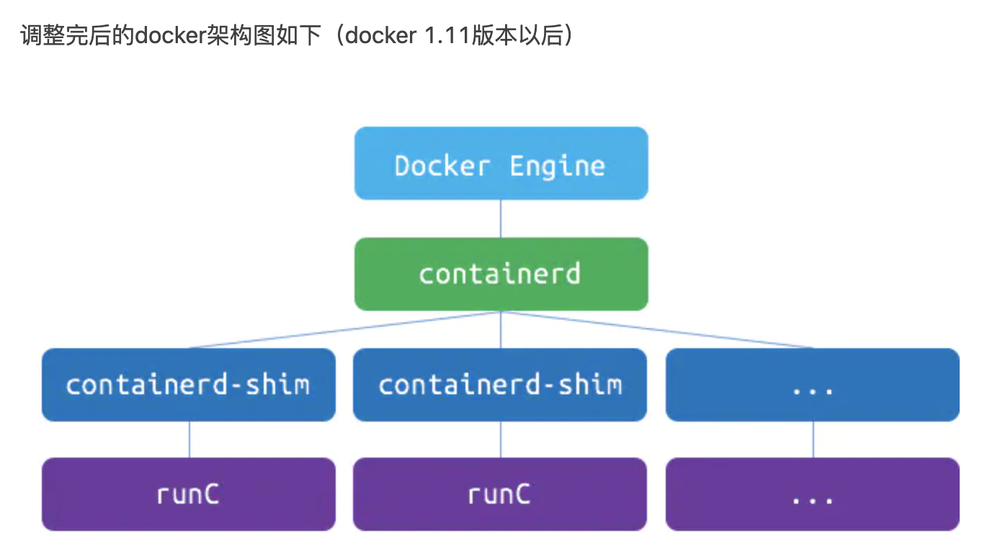

- [容器container概念](#容器container概念)
- [Docker概念](#Docker概念)
- [Kubernetes概念](#Kubernetes概念)

---------------------------------------------------------------------------------------------------------------------
## 容器container概念

[容器开放接口规范（CRI OCI CNI）](容器开放接口规范（CRI%20OCI%20CNI）.md)

CRI - Container Runtime Interface（容器运行时接口）

CNI - Container Network Interface(容器网络接口)

OCI - Open Container Initiative

CRI, OCI, and CRI-O
Describe Kubernetes CRI, Container standard OCI, and a OCI-complimant CRI implementation CRI-O

OCI是容器Container的标准
CRI是Kubernetes API

OCI Compatible: runC, Kata(以及它的前身 runV 和 Clear Containers), gVisor. 其它比较偏门的还有 Rust 写的 railcar
CRI Compatible: Docker(借助 dockershim), containerd(借助 CRI-containerd), CRI-O, frakti, etc.

CRI的实现包括：containerd（Docker的）、CRI-O（K8S的）等
OCI的实现包括：runC（Docker的）

runc 的几个替代方案是：
- crun用C编写的容器运行时（相比之下，runc 是用 Go 编写的。）
- 来自Katacontainers项目的kata-runtime，它将 OCI 规范实现为单独的轻量级 VM（硬件虚拟化）
- 来自 Google 的gVisor，它创建具有自己内核的容器。它在名为runsc.

其实可以总结出整个 runtime 架构万变不离其宗的三层抽象:  
Orchestration API -> Container API -> Kernel API

这其中 k8s 已经是 Orchestration API 的事实标准, 而在 k8s 中, Container API 的接口标准就是 CRI, 由 cri-runtime 实现, Kernel API 的规范是 OCI, 由 oci-runtime 实现.

---------------------------------------------------------------------------------------------------------------------

## Docker概念

容器管理系统（例如rkt或Kubernetes）

docker架构docker architecture

Docker Engine(docker daemon)
|
|
containerd

containerd-shim     containerd-shim
runC                runC

docker-architecture.png

---------------------------------------------------------------------------------------------------------------------

## Kubernetes概念

### Dockershim

Dockershim是K8S对老的Docker（没有实现 CRI）的支持

Kubelet通过CRI接口(gRPC)调用docker-shim（docker-shim是内嵌在Kubelet中的）
docker-shim收到请求后,转化成Docker Daemon能听懂的请求,发到Docker Daemon上请求创建一个容器
Docker Daemon请求containerd创建一个容器
containerd收到请求后创建一个containerd-shim进程,通过containerd-shim操作容器,容器进程需要一个父进程来做诸如收集状态, 维持stdin等fd打开等工作
containerd-shim在调用runC来启动容器
runC 启动完容器后本身会直接退出,containerd-shim则会成为容器进程的父进程,负责收集容器进程的状态,上报给containerd

Dockershim：Kubernetes 中的 Docker
Kubernetes 包含一个名为dockershim的组件，它允许它支持 Docker。
Kubernetes 更喜欢通过任何支持其容器运行时接口 (CRI) 的容器运行时来运行容器。
但是比 Kubernetes 更老的 Docker 没有实现 CRI。所以这就是dockershim存在的原因，基本上是将 Docker 固定到 Kubernetes 上。或者将 Kubernetes 放到 Docker 上，无论您喜欢哪种方式。

参考  
[The differences between Docker, containerd, CRI-O and runc](https://www.tutorialworks.com/difference-docker-containerd-runc-crio-oci/)  
[OCI,CRI到kubernetes runtime](https://www.jianshu.com/p/c7748893ab00)  
[白话 Kubernetes Runtime](https://zhuanlan.zhihu.com/p/58784095)  

